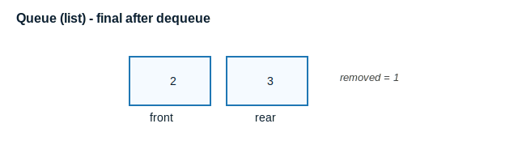
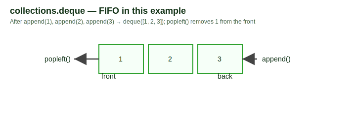
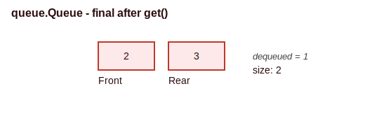
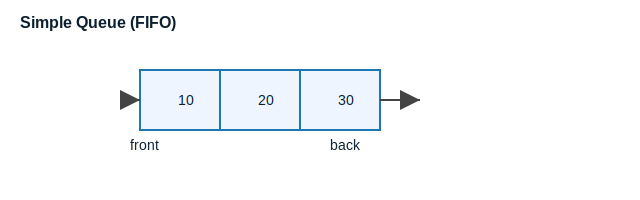
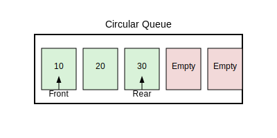
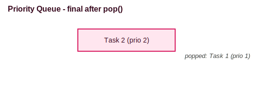
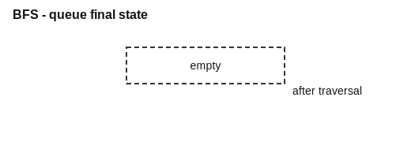

<!--
module_id: data_structures_advanced/vis_demo
author:   Amir Kayhani
email:    Amir.kayhani@warwick.ac.uk
version: 0.0.1
current_version_description: Initial version
module_type: standard
docs_version: 2.0.0
language: en
narrator: UK English Female
mode: Textbook
title: data_structures_advanced/vis_demo
comment:  A demo of visualisations for algorithms
estimated_time_in_minutes: 20

link:  ../assets/styles.css
import: ../module_templates/macros.md
import: ../module_templates/macros_algo_visualisations.md
import: ../module_templates/macros_python.md
import: https://dscroft.github.io/Pyodide/README.md
import: https://github.com/LiaScript/CodeRunner/blob/master/README.md

-->

# Attribution

@algo_attribution


# Queues in Python

Queues are a fundamental data structure in computer science, used in various applications such as task scheduling, breadth-first search, and buffering. This section provides a comprehensive guide to understanding, implementing, and applying queues in Python. It includes explanations, Python code examples, diagrams, and exercises to solidify your understanding.

---

## 1. Introduction to Queues

A queue is a linear data structure that follows the First In First Out (FIFO) principle. The element added first is the one to be removed first. Queues are widely used in scenarios where order needs to be preserved.

### Key Operations:
- **Enqueue**: Add an element to the rear of the queue.
- **Dequeue**: Remove an element from the front of the queue.
- **Peek**: View the front element without removing it.
- **isEmpty**: Check if the queue is empty.

### Real-World Applications:
- Task scheduling in operating systems.
- Breadth-first search in graph algorithms.
- Managing requests in web servers.

---

## 2. Implementing Queues in Python

### Using Lists
Python lists can mimic a queue for small workloads or quick prototypes, but removing from the front is costly because every remaining element must shift left. This makes lists useful for teaching FIFO behaviour, while highlighting why specialised queue types exist for production code.

**How the walkthrough progresses**
1. Begin with an empty list.
2. Append three numbers, so the queue becomes `[1, 2, 3]`.
3. Dequeue with `pop(0)`, which shifts the remaining numbers left; the queue now holds `[2, 3]`.
4. Print statements confirm both the dequeued value and the final state that the diagram illustrates.

@info Complexity snapshot
- Enqueue via `append(...)` is amortised `O(1)`.
- Dequeue via `pop(0)` is `O(n)` because of element shifting.
- Peek with `queue[0]` would be `O(1)`.

```python
# Queue implemented with a Python list (educational example).
queue = []

# Enqueue three items (FIFO order of arrival).
queue.append(1)
queue.append(2)
queue.append(3)
print("Queue after enqueuing:", queue)

# Dequeue the oldest item (expensive O(n) operation).
removed = queue.pop(0)
print("Dequeued element:", removed)
print("Queue after dequeuing:", queue)
```
@Pyodide.eval



### Using `collections.deque`
The `deque` class from the `collections` module is optimized for fast appends and pops from both ends.

```python
from collections import deque

# Queue implementation using deque
queue = deque()

# Enqueue
queue.append(1)
queue.append(2)
queue.append(3)
print("Queue after enqueuing:", queue)

# Dequeue
print("Dequeued element:", queue.popleft())
print("Queue after dequeuing:", queue)
```
@Pyodide.eval



### Using `queue.Queue`
The `queue.Queue` class is thread-safe and suitable for multi-threaded applications.

```python
from queue import Queue

# Queue implementation using queue.Queue
queue = Queue()

# Enqueue
queue.put(1)
queue.put(2)
queue.put(3)
print("Queue size:", queue.qsize())

# Dequeue
print("Dequeued element:", queue.get())
print("Queue size after dequeuing:", queue.qsize())
```
@Pyodide.eval



---

## 3. Types of Queues

### 3.1 Simple Queue
A basic FIFO queue. Suitable for scenarios requiring strict order.

```python
from collections import deque

class SimpleQueue:
    def __init__(self):
        self._q = deque()

    def enqueue(self, item):
        self._q.append(item)

    def dequeue(self):
        if self.is_empty():
            raise IndexError("dequeue from empty queue")
        return self._q.popleft()

    def peek(self):
        if self.is_empty():
            raise IndexError("peek from empty queue")
        return self._q[0]

    def is_empty(self):
        return len(self._q) == 0

# Demo
sq = SimpleQueue()
sq.enqueue(10)
sq.enqueue(20)
print("Front element:", sq.peek())
print("Dequeued element:", sq.dequeue())
```
@Pyodide.eval



### 3.2 Circular Queue

A circular queue is a linear data structure that connects the last position back to the first position to form a circle. This structure is particularly useful for scenarios where memory needs to be utilized efficiently, such as in buffering and scheduling tasks. Unlike a regular queue, which operates in a strictly linear fashion, the circular queue wraps around, making it a more memory-efficient option in constrained environments.


*Image Source: [Angel Vyas - Circular Queue](https://angelvyas.com/posts/data_structures/circularq/)*

#### Key Features:
- **Efficient Memory Usage**: Unlike a simple queue, a circular queue reuses empty spaces created by dequeuing elements. This ensures that no memory is wasted, especially in scenarios where the queue is frequently updated.
- **Fixed Size**: Circular queues are often implemented with a fixed size, making them suitable for hardware-level applications where memory constraints are critical. For example, embedded systems often use circular queues to manage tasks efficiently.

#### Operations:
- **Enqueue**: Add an element to the rear of the queue. If the queue is full, the operation cannot proceed, and an overflow condition is raised.
- **Dequeue**: Remove an element from the front of the queue. If the queue is empty, the operation cannot proceed, and an underflow condition is raised.
- **isFull**: Check if the queue is full. This operation is crucial for ensuring that no additional elements are added beyond the queue's capacity.
- **isEmpty**: Check if the queue is empty. This operation helps in determining whether there are any elements to process.

#### Python Implementation:
```python
class CircularQueue:
    def __init__(self, size):
        self.size = size
        self.queue = [None] * size
        self.front = self.rear = -1

    def enqueue(self, item):
        if (self.rear + 1) % self.size == self.front:
            raise OverflowError("Queue is full")
        elif self.front == -1:  # First element
            self.front = self.rear = 0
        else:
            self.rear = (self.rear + 1) % self.size
        self.queue[self.rear] = item

    def dequeue(self):
        if self.front == -1:
            raise IndexError("Queue is empty")
        item = self.queue[self.front]
        if self.front == self.rear:  # Single element
            self.front = self.rear = -1
        else:
            self.front = (self.front + 1) % self.size
        return item

    def is_empty(self):
        return self.front == -1

    def is_full(self):
        return (self.rear + 1) % self.size == self.front

    def display(self):
        if self.front == -1:
            print("Queue is empty")
        elif self.rear >= self.front:
            print("Queue:", self.queue[self.front:self.rear + 1])
        else:
            print("Queue:", self.queue[self.front:] + self.queue[:self.rear + 1])

# Demo
cq = CircularQueue(5)
cq.enqueue(10)
cq.enqueue(20)
cq.enqueue(30)
cq.display()
print("Dequeued:", cq.dequeue())
cq.display()
```
@Pyodide.eval




*Image Source: [Angel Vyas - Circular Queue](https://angelvyas.com/posts/data_structures/circularq/)*

#### Applications of Circular Queues:
- **Task Scheduling**: Circular queues are used in round-robin scheduling algorithms. These algorithms allocate a fixed time slice to each task, ensuring fairness and efficient CPU utilization.
- **Buffering**: Used in scenarios like streaming data where a fixed-size buffer is required. For instance, audio and video streaming applications use circular queues to manage data packets efficiently.
- **Traffic Management**: Circular queues help in managing traffic signals efficiently. By cycling through signals in a fixed order, circular queues ensure smooth traffic flow and reduce congestion.
- **Data Mining and AI**: Circular queues are used in sliding window algorithms, which are essential for processing streaming data. For example, in real-time anomaly detection or predictive modeling, a circular queue can maintain a fixed-size window of the most recent data points for analysis. Another example is in natural language processing (NLP), where circular queues can be used to manage a rolling context window for tasks like sentiment analysis or text summarization.

### 3.3 Priority Queue
Processes elements based on priority rather than order.

```python
import heapq

class PriorityQueue:
    def __init__(self):
        self._heap = []

    def push(self, priority, item):
        heapq.heappush(self._heap, (priority, item))

    def pop(self):
        if not self._heap:
            raise IndexError("pop from empty priority queue")
        return heapq.heappop(self._heap)

# Demo
pq = PriorityQueue()
pq.push(2, "Task 2")
pq.push(1, "Task 1")
print("Popped element:", pq.pop())
```
@Pyodide.eval



---

## 4. Applications of Queues

### Task Scheduling
Queues manage tasks in operating systems, ensuring fair processing.

### Breadth-First Search (BFS)
```python
from collections import deque

def bfs(graph, start):
    visited = set()
    queue = deque([start])

    while queue:
        node = queue.popleft()
        if node not in visited:
            print(node, end=" ")
            visited.add(node)
            queue.extend(graph[node])

graph = {
    'A': ['B', 'C'],
    'B': ['D', 'E'],
    'C': ['F'],
    'D': [],
    'E': ['F'],
    'F': []
}

bfs(graph, 'A')
```
@Pyodide.eval



---

## 5. Exercises

### Exercise 1: Basic Queue Operations
Implement a queue using `collections.deque` and perform the following operations:
1. Enqueue elements 10, 20, 30.
2. Dequeue an element.
3. Check the front element.
4. Check if the queue is empty.

```python

```
@Pyodide.eval

### Exercise 2: Circular Queue
Implement a circular queue with a fixed size of 5. Perform enqueue and dequeue operations and handle overflow and underflow conditions.
```python

```
@Pyodide.eval

### Exercise 3: Priority Queue
Use `queue.PriorityQueue` to implement a task scheduler where tasks with higher priority are executed first.

```python

```
@Pyodide.eval

---

# Tree Algorithms

@sectiontoc


## Binary Search Tree

@algo_vis(LiaBST)


## AVL Trees (Balanced binary search trees)

@algo_vis(LiaAVLtree)


## Red-Black Trees

@algo_vis(LiaRedBlack)


## Splay Trees

@algo_vis(LiaSplayTree)


# Graph Algorithms

@sectiontoc


## Breadth-First Search

@algo_vis(LiaBFS)


## Depth-First Search

@algo_vis(LiaDFS)


## Connected Components

@algo_vis(LiaConnectedComponent)


## Dijkstra's Shortest Path

@algo_vis(LiaDijkstra)


## Prim's Minimum Cost Spanning Tree

@algo_vis(LiaPrim)


## Topological Sort (Using Indegree array) 

@algo_vis(LiaTopoSortIndegree)


## Topological Sort (Using DFS) 

@algo_vis(LiaTopoSortDFS)


## Floyd-Warshall (all pairs shortest paths)

@algo_vis(LiaFloyd)


## Kruskal Minimum Cost Spanning Tree Algorith

@algo_vis(LiaKruskal)


